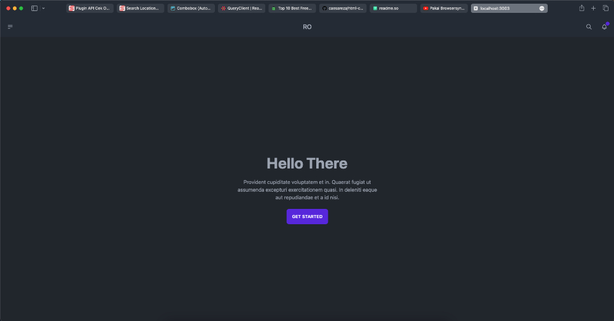

# HTML CSS Browsersync

Ini adalah tutorial untuk testing website di banyak device menggunakan Browsersync


## Screenshots




## Run Locally

Clone the project

```bash
  git clone https://github.com/caesareza/html-css-browsersync-tutorial
```

Go to the project directory

```bash
  cd html-css-browsersync-tutorial
```

Install dependencies

```bash
  npm install
```

Start the server

```bash
  npm run dev
```


## Demo

http://localhost:3000


## Youtube Channel

 - [Lihat di YouTube](https://www.youtube.com/watch?v=V4fOPdggK0M)

